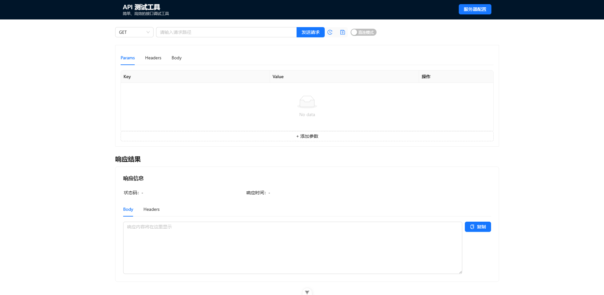
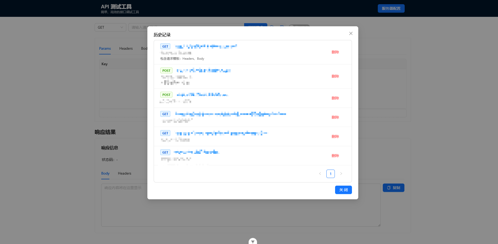

# 轻量级API测试工具

一个简单、高效的接口调试工具,使用 Vue3 + Ant Design Vue 开发。

## 主要功能

- 支持常用 HTTP 请求方法(GET、POST、PUT、DELETE)
- 内置请求代理模式,轻松解决跨域问题
- 完整的请求配置
  - URL 参数管理
  - Headers 自定义
  - 多种格式的请求体(JSON、Form-data等)
- 请求历史记录
  - 保存历史请求信息
  - 一键恢复历史请求
- 清晰的响应展示
  - 状态码和响应时间
  - 格式化的响应数据
  - Headers 信息展示
  - 响应数据一键复制

